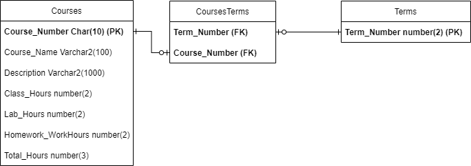

# Understanding the Project
1. Analyze the crowd sourcing questions using the official Dawson College course information
2. Run the main.py script 
   1. Ask the user if they want to reset the database tables
3. What are the outputs of the programs?
   1. The correlation analysis will be output to file/s.
   2. The dawson courses data will be output to a database
4. What are the data sources?
   1. Dawson computer science course list: The term number, the courses, the course descriptions, the courses in each term.
   2. Dawson subreddit: Posts related to computer science, comments
   3. What will be done with the data?
      1. Course list: Put in a database for it to be easily accessible 
      2. Reddit: Analyse the data using nltk and the course list information
5. What tools and languages will be required?
   1. Languages: Python, SQL, PLSQL, HTML
   2. Libraries: NLTK, Cx_Oracle, Matplotlib
   3. APIs: PushshiftIO, Reddit API
   4. Dev setup steps: Gitlab repo, conda environment, temporary database for testing, install libraries
   5. User set up steps: Clone the repo, conda environment, install libraries
6. What is the deliverable?
   1. The python scripts
   2. The report using the data

# Examining the data and APIs
## Reddit
1. What is Reddit?: A forum for posting questions, images, memes, opinions about related topics
   1. What is a subreddit?: A group for related posts about a topic
   2. What is a post?: a piece of writing, image, or other item of content published on a subreddit
   3. What is a comment?: A response to a post using text
2. How are posts and comments Ranked?: They are ranked by users which upvote (add points to a post) or downvote (remove points from a post)
3. What is a moderator?: Person who moderates a subreddit or posts discussions to ensure that they are within the subreddit guidelines
4. What is the Dawson subreddit?: It is a subreddit about Dawson and dawson related questions

## PushShift.IO Rest API
1. What is PushShift.IO: Is a reddit api with enhanced search capabilities
2. [Docs](https://github.com/pushshift/api)
3. What does the API do?: it searches posts and comments of reddit and subreddits for specific queries
4. Do a get request to the /reddit/submission and specify the subreddit parameter
5. specify the before and after parameters
6. What information might not be up to date in the PushShift.IO data: the posts, comments and upvotes might not be updated because there is a time gap between when a post is posted and when the PushShift.IO has the data in their database.

## Reddit Rest API
1. What is it?: It is a Rest API provided directly by Reddit to get live data from posts and subreddits
2. [DOCS](https://github.com/pushshift/api)
3. What does it do?: It fetches live data from the latest post, and posting to a subreddit
4. What feature might we want?: The live upvote count

# Code design
1. How should the SQL database be designed?
   1. What are the tables?: Courses, Terms, CoursesTerms
      1. Courses:
         1. Course Number (PK) CHAR(10)
         2. Course Name Varchar2(100)
         3. Description Varchar2(1000)
      2. Terms:
         1. Term Number (PK) number(2)
      3. CoursesTerms:
         1. Term Number (FK, PK)
         2. Course Number (FK, PK)
   2. Which pythong module the module will be runnable?: analysis.py
   3. What is the functionality of each module?:
      1. course_list_scraper.py:
         1. No classes
         2. main function that returns the scrapped data
         3. Other functions that get and reduce the scrapped data
      2. reddit_scraper.py:
         1. No classes
         2. main function that returns the scrapped data
         3. Other functions that get and reduce the scrapped data
      3. OracleDatabase:
         1. One class: connects to the database and performs CRUD operations
         2. No functions
      4. analysis.py:
         1. No classes
         2. has the main function
         3. incorporates the reddit_scraper and the course_list_scraper to get the data
         4. Uses the OracleDatabase to update the data in the database
         
## ERD
